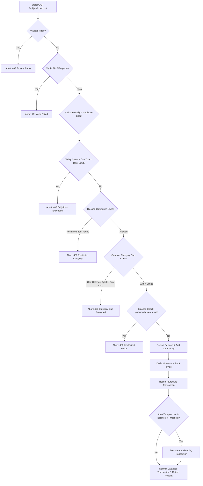

# School Digital Wallet & POS System: Backend Developer Integration Guide

This document serves as the complete technical blueprint for backend developers implementing database schemas, RESTful APIs, business logic controllers, and payment gateway integrations.

---

## 1. Relational Database Schema Design (SQL)

To migrate the frontend client-side `localStorage` database state into a permanent relational storage model, implement the following tables:

### 1.1 `wallets` Table
Stores student balances, limits, and gateway configurations.
```sql
CREATE TABLE wallets (
    student_id VARCHAR(50) PRIMARY KEY,
    student_name VARCHAR(150) NOT NULL,
    balance DECIMAL(12, 2) NOT NULL DEFAULT 0.00,
    daily_limit DECIMAL(12, 2) NOT NULL DEFAULT 2000.00,
    spent_today DECIMAL(12, 2) NOT NULL DEFAULT 0.00,
    status ENUM('active', 'frozen') NOT NULL DEFAULT 'active',
    bank_name VARCHAR(100) NOT NULL DEFAULT 'Providus Bank',
    account_number VARCHAR(20) NOT NULL UNIQUE,
    account_name VARCHAR(200) NOT NULL,
    pin_hash VARCHAR(255) NOT NULL, -- Hashed 4-digit PIN (default '1234')
    auto_topup BOOLEAN NOT NULL DEFAULT FALSE,
    auto_threshold DECIMAL(12, 2) NOT NULL DEFAULT 500.00,
    auto_amount DECIMAL(12, 2) NOT NULL DEFAULT 2000.00,
    created_at TIMESTAMP DEFAULT CURRENT_TIMESTAMP,
    updated_at TIMESTAMP DEFAULT CURRENT_TIMESTAMP ON UPDATE CURRENT_TIMESTAMP
);
```

### 1.2 `wallet_allowed_categories` Table
Configures category restriction rules (governed by parents).
```sql
CREATE TABLE wallet_allowed_categories (
    student_id VARCHAR(50) PRIMARY KEY,
    canteen BOOLEAN NOT NULL DEFAULT TRUE,
    stationery BOOLEAN NOT NULL DEFAULT TRUE,
    uniforms BOOLEAN NOT NULL DEFAULT TRUE,
    books BOOLEAN NOT NULL DEFAULT TRUE,
    FOREIGN KEY (student_id) REFERENCES wallets(student_id) ON DELETE CASCADE
);
```

### 1.3 `wallet_category_limits` Table
Defines granular category-specific daily caps (governed by parents).
```sql
CREATE TABLE wallet_category_limits (
    student_id VARCHAR(50) PRIMARY KEY,
    canteen DECIMAL(12, 2) NOT NULL DEFAULT 1000.00,
    stationery DECIMAL(12, 2) NOT NULL DEFAULT 2000.00,
    uniforms DECIMAL(12, 2) NOT NULL DEFAULT 5000.00,
    books DECIMAL(12, 2) NOT NULL DEFAULT 5000.00,
    FOREIGN KEY (student_id) REFERENCES wallets(student_id) ON DELETE CASCADE
);
```

### 1.4 `wallet_transactions` Table
Tracks audit ledger records chronologically.
```sql
CREATE TABLE wallet_transactions (
    id VARCHAR(50) PRIMARY KEY, -- TXN_W_[random] or UUID
    student_id VARCHAR(50) NOT NULL,
    amount DECIMAL(12, 2) NOT NULL,
    type ENUM('deposit', 'purchase', 'adjustment') NOT NULL,
    adj_type ENUM('credit', 'debit') NULL,
    item TEXT NOT NULL, -- e.g. "1x Mathematical Set, 2x Pens" or remarks
    method VARCHAR(50) NULL, -- e.g. "Paystack", "Manual Adjustment"
    verification ENUM('Fingerprint', 'PIN') NULL,
    cashier_id VARCHAR(50) NULL, -- Staff username/ID
    date TIMESTAMP DEFAULT CURRENT_TIMESTAMP,
    FOREIGN KEY (student_id) REFERENCES wallets(student_id) ON DELETE CASCADE
);
```

### 1.5 `wallet_gateway_settings` Table
Global system credentials and parameters (governed by admin profile).
```sql
CREATE TABLE wallet_gateway_settings (
    id INT AUTO_INCREMENT PRIMARY KEY,
    gateway ENUM('paystack', 'flutterwave', 'stripe') NOT NULL DEFAULT 'paystack',
    mode ENUM('simulation', 'sandbox', 'live') NOT NULL DEFAULT 'simulation',
    fee_percent DECIMAL(5, 2) NOT NULL DEFAULT 1.50,
    fee_flat DECIMAL(12, 2) NOT NULL DEFAULT 100.00,
    max_limit DECIMAL(12, 2) NOT NULL DEFAULT 15000.00,
    low_threshold DECIMAL(12, 2) NOT NULL DEFAULT 500.00,
    public_key VARCHAR(255) NULL,
    secret_key VARCHAR(255) NULL,
    updated_at TIMESTAMP DEFAULT CURRENT_TIMESTAMP ON UPDATE CURRENT_TIMESTAMP
);
```

---

## 2. API Endpoint Specifications

The backend must provide the following RESTful routing structures:

### 2.1 Admin Controllers

*   **`GET /api/admin/wallets`**
    *   **Description:** Fetch list of all student wallets (supports filtering by class and name/virtual account).
    *   **Response Status:** `200 OK`
    *   **Payload Schema:**
        ```json
        [
          {
            "studentId": "STU001",
            "studentName": "Amara Okafor",
            "class": "SSS3A",
            "accountNumber": "9928104812",
            "dailyLimit": 2000.00,
            "balance": 15000.00,
            "status": "active"
          }
        ]
        ```

*   **`POST /api/admin/wallets/bulk-adjust`**
    *   **Description:** Apply manual balance adjustments in bulk to students filtered by class.
    *   **Payload Schema:**
        ```json
        {
          "targetClass": "SS3", -- Or "all"
          "type": "credit", -- "credit" or "debit"
          "amount": 500.00,
          "reason": "Scholarship top-up"
        }
        ```
    *   **Response Status:** `200 OK`

*   **`GET /api/admin/wallets/settings`** & **`PUT /api/admin/wallets/settings`**
    *   **Description:** Get/update global gateway config keys, deposit fee policies, and transaction bounds.
    *   **Response Status:** `200 OK`

---

### 2.2 Parent Portal Controllers

*   **`GET /api/parent/children/{student_id}/wallet`**
    *   **Description:** Get child wallet balance, auto-refill values, category block selections, and specific daily caps.
    *   **Response Status:** `200 OK`

*   **`PUT /api/parent/children/{student_id}/wallet-controls`**
    *   **Description:** Update spending rules.
    *   **Payload Schema:**
        ```json
        {
          "dailyLimit": 2500,
          "allowedCategories": {
            "canteen": true,
            "stationery": false,
            "uniforms": true,
            "books": true
          },
          "categoryLimits": {
            "canteen": 1000,
            "stationery": 2000,
            "uniforms": 5000,
            "books": 5000
          },
          "autoTopup": true,
          "autoThreshold": 500,
          "autoAmount": 2000
        }
        ```
    *   **Response Status:** `200 OK`

---

### 2.3 Cashier POS Controllers

*   **`GET /api/pos/student-identify/{id_or_nfc}`**
    *   **Description:** Find student and retrieve wallet parameters for validation.
    *   **Response Status:** `200 OK`

*   **`POST /api/pos/checkout`**
    *   **Description:** Finalize purchase transaction, decrementing student wallet balance and inventory stock levels.
    *   **Payload Schema:**
        ```json
        {
          "studentId": "STU001",
          "totalAmount": 1250.00,
          "verification": "Fingerprint", -- "Fingerprint" or "PIN"
          "pinCode": "1234", -- Required only if verification is "PIN"
          "items": [
            { "id": "INV001", "name": "Notebook", "price": 450, "quantity": 1, "category": "stationery" },
            { "id": "INV002", "name": "Lunch Plate", "price": 800, "quantity": 1, "category": "canteen" }
          ]
        }
        ```
    *   **Response Status:** `200 OK` or `400 Bad Request` (on limit failures)

---

## 3. POS Transaction Authorization Validation Engine (Critical Core Logic)

When a cashier submits a purchase transaction through **`POST /api/pos/checkout`**, the backend must execute the following sequence of checks inside a **database transaction block**:



### 3.1 Detailed Steps:

1.  **Freeze Check:** Retrieve student's wallet status. If status is `frozen`, throw `403 Forbidden` ("Wallet locked/frozen by student/parent").
2.  **Daily Allowance Cap Check:**
    *   Sum the amounts of all transactions for this student where the date is today (date parts matching current server date) and transaction type is `purchase`.
    *   If `today_spent_sum + totalAmount > daily_limit`, return `400 Bad Request` ("Exceeds daily spending limit").
3.  **Category Restriction Check:**
    *   Iterate through all items in the payload. Compare item categories against parent-blocked flags.
    *   If any item belongs to a category where `allowedCategories[category] == false`, return `400 Bad Request` ("Purchase category restricted by parent").
4.  **Granular Category Cap Check:**
    *   Tally the total price of cart items grouped by category.
    *   Compare the group total against `wallet_category_limits`.
    *   If the total cost of any category in the current cart exceeds `categoryLimits[category]`, return `400 Bad Request` ("Exceeds category cap limit").
5.  **Balance Check:**
    *   Compare `wallet.balance` against `totalAmount`.
    *   If `balance < totalAmount`, return `400 Bad Request` ("Insufficient wallet funds").
6.  **Debit Ledger Processing:**
    *   Decrement `wallet.balance` by `totalAmount`.
    *   Increment `wallet.spentToday` by `totalAmount`.
    *   Save a record into `wallet_transactions` with type `purchase`, status `Successful`, and details populated.
    *   Update inventory stock quantities (decrement stock level based on items sold).
7.  **Auto-Refill Trigger:**
    *   Check if `auto_topup` is `TRUE` and the newly updated balance is less than `auto_threshold`.
    *   If triggered, execute a charge request on the parent's linked payment authorization gateway token (simulated on server using config credentials).
    *   Increment student's `wallet.balance` by `auto_amount`.
    *   Save an additional record in `wallet_transactions` with type `deposit`, details "Parent Triggered Auto-Topup", and transaction code prefix `TXN_A_`.
8.  **Commit:** Commit transaction and output final checkout response.
